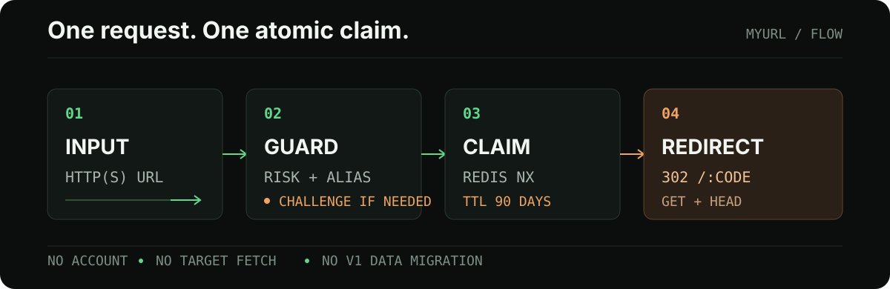

# MyURL v2

<p align="center">
  
</p>

<p align="center">
  <a href="https://github.com/keleyaa/MyUrls/actions/workflows/ci.yml"></a>
  <a href="https://github.com/keleyaa/MyUrls/blob/master/LICENSE"></a>
</p>

匿名、无统计的 HTTP(S) 短链工具。提交一个 URL，生成 8 位短码；短链固定有效 90 天，并在浏览器允许时自动复制。

## 先看结果

MyURL v2 只做一件事：把一个绝对 HTTP(S) URL 变成一个短而清晰、会自动过期的入口。

- 不需要账号，不记录访问统计，也不保存原始 IP。
- 自动短码使用 8 位大小写敏感 Base62；也可以指定 4–32 位 ASCII 小写别名。
- 结果默认自动复制；浏览器拒绝剪贴板权限时，点击结果即可再次复制。

## 请求路径

<p align="center">
  
</p>

## 设计边界

### 接受什么

- 只接受绝对 `http://` 或 `https://` URL。
- 服务端不会抓取目标、解析 DNS 或预览页面。
- 自定义别名会规范化为 ASCII 小写，并与自动短码共享 Redis `NX` 命名空间。
- 风险达到阈值时才加载 Turnstile；限流标识使用 HMAC-SHA-256 指纹。

### 明确不做什么

- 不提供账号、后台、访问统计、二维码、密码保护或一次性链接。
- 不提供自定义域名、目标 URL 抓取和页面预览。
- v2 使用独立 Redis keyspace 和数据卷，不读取或迁移旧数据。

## 快速开始

### 本地开发

环境要求：Node.js `24.14.1`、Corepack，以及用于完整验证的 Docker Compose v2、Chromium、WebKit 和 Trivy `0.74.0`。

```sh
corepack pnpm install --frozen-lockfile
corepack pnpm build
```

启动本地 API（内存存储，不连接 Redis）：

```sh
NODE_ENV=test \
PUBLIC_BASE_URL=http://127.0.0.1:3000 \
IP_HASH_SECRET=local-development-secret-that-is-at-least-32-bytes \
TURNSTILE_ENABLED=false \
TEST_STORE=memory \
corepack pnpm dev:server
```

另开一个终端启动页面：

```sh
corepack pnpm dev:web
```

打开 <http://127.0.0.1:5173>。Vite 会把 `/api` 和 `/health` 请求代理到本地 API。

### Compose 运行

```sh
cp .env.example .env
```

编辑 `.env`，至少替换 `PUBLIC_BASE_URL`、`IP_HASH_SECRET` 和生产 Turnstile 配置，然后启动：

```sh
docker compose up -d --build --wait
```

Compose 只启动 `app` 和 `redis`。应用容器监听 `3000`，宿主机默认只绑定 `127.0.0.1:${APP_PORT:-3000}`；Redis 不发布宿主机端口。

## HTTP 合同

创建短链接：

```sh
curl --fail-with-body http://127.0.0.1:3000/api/v1/links \
  -H 'Content-Type: application/json' \
  -d '{"url":"https://example.com/docs","alias":"docs"}'
```

成功返回 `201`：

```json
{
  "code": "docs",
  "shortUrl": "https://myurl.example/docs",
  "expiresAt": "2026-11-25T12:00:00.000Z"
}
```

核心路由：

```text
POST /api/v1/links  -> 201，返回 code、shortUrl、expiresAt
GET  /:code         -> 302，Location 指向原始目标
HEAD /:code         -> 302，不返回响应体
GET  /health/live   -> 200，不访问 Redis
GET  /health/ready  -> 200 或 503，执行 Redis PING
```

创建接口使用稳定错误码，例如 `invalid_request`、`url_not_allowed`、`alias_invalid`、`alias_unavailable`、`challenge_required`、`rate_limited` 和 `dependency_unavailable`。解析不到短码或短链已过期时返回 `404`。

## 代码结构

```text
apps/web/           Svelte 页面、交互状态机和本地资源
apps/server/        Fastify HTTP 层、ShortLinkService 和外部适配器
packages/contracts/ TypeBox JSON Schema 与共享 TypeScript 类型
tests/e2e/          Chromium、移动 Chromium、WebKit 用户流程
ops/                Compose 验证、性能、备份恢复和安全扫描
```

`ShortLinkService` 是业务边界。路由层只负责 schema、可信来源上下文和 HTTP 映射；URL 策略、别名、风险、Redis 原子写入和 TTL 都隐藏在服务接口之后。Redis 和 Turnstile 通过适配器接入，测试可以替换为内存实现。

## 验证

运行完整发布门禁：

```sh
corepack pnpm verify
```

它会依次检查格式、ESLint、严格 TypeScript、单元覆盖率、真实 Redis、API 合同、生产构建、浏览器流程、Compose 构建与重启持久化、性能、备份恢复、依赖审计、容器安全和运行时外部资源。任一步失败都会返回非零状态。

常用单项检查：

```sh
corepack pnpm format
corepack pnpm lint
corepack pnpm typecheck
corepack pnpm test:unit
corepack pnpm test:api
corepack pnpm test:integration
corepack pnpm build
corepack pnpm test:e2e
```

## 镜像发布

GitHub Actions 的 `Publish GHCR image` 支持版本化手动发布：

1. 打开 **Actions → Publish GHCR image → Run workflow**。
2. 在 `version` 中输入稳定版本，例如 `v2.0.0`。
3. 工作流先执行完整 CI，再发布多架构镜像，并为当前提交创建同名的 annotated Git tag。

稳定版本会同时发布版本标签、提交 SHA 标签和 `latest`；不符合 `vX.Y.Z` 的手动输入会被拒绝。若远端同名 Git tag 已存在，工作流会在构建前失败，避免覆盖既有稳定版本。

```text
ghcr.io/keleyaa/myurls:v2.0.0
ghcr.io/keleyaa/myurls:latest
```

## 运维边界

MyUrls v2 提供应用与 Redis 两个运行单元。公网入口、TLS、域名解析、主机防火墙、外部备份和日志平台需要由部署环境补齐；部署与恢复说明见 [v2 运维指南](docs/operations.md)。

## License

[MIT License](LICENSE)
