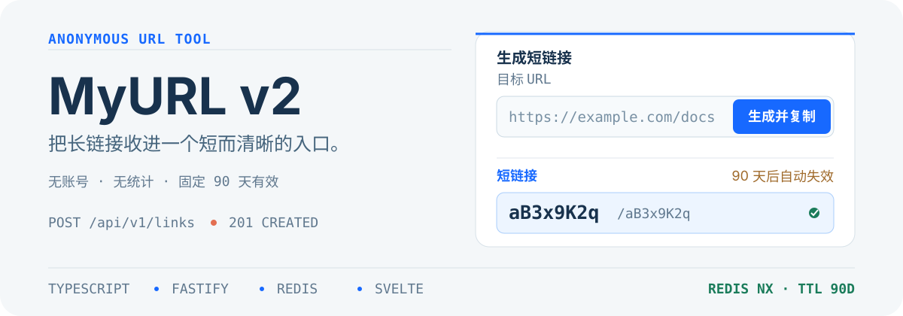

# myurl

<p align="center">
  
</p>

一个自托管、匿名的短链工具。提交一个 HTTP(S) URL，得到固定 90 天有效的短入口；浏览器允许时，结果会自动复制。

## 创建一条短链

```sh
curl --fail-with-body http://127.0.0.1:3000/api/links \
  -H 'Content-Type: application/json' \
  -d '{"url":"https://example.com/docs","alias":"docs"}'
```

成功时返回：

```json
{
  "code": "docs",
  "shortUrl": "https://myurl.example/docs",
  "expiresAt": "2030-03-01T12:00:00.000Z"
}
```

`expiresAt` 始终是创建时刻加 90 天的 RFC 3339 UTC 时间。自动短码为 10 位 Base62；需要稳定路径时可传入 4-32 位 ASCII 小写 `alias`。别名是公开路径，不应承载保密信息。

## 服务如何工作

- 只接受绝对 `http://` 或 `https://` URL；服务端不会抓取目标、解析 DNS 或生成页面预览。
- 不需要账号，不提供访问统计，也不记录原始 IP。限流使用 HMAC-SHA-256 客户端指纹。
- 短码和别名通过 Redis `SET NX EX` 原子占位，固定保存 90 天；创建与解析请求均受限流和风险策略保护。
- 生产创建可要求 Cloudflare Turnstile；目标 URL 受到 SSRF 与保留地址策略保护。
- 不提供后台、二维码、密码保护、一次性链接或旧数据迁移。

## 运行

复制环境模板，填写 `PUBLIC_BASE_URL`、`IP_HASH_SECRET` 和生产 Turnstile 配置后启动：

```sh
cp .env.example .env
docker compose up -d --build --wait
```

Compose 只包含 `app` 与 `redis`。应用默认只绑定 `127.0.0.1:${APP_PORT:-3000}`，Redis 不发布宿主机端口。公网入口、TLS、域名解析、主机防火墙和异机备份由部署环境负责，详见[运维指南](docs/operations.md)。

## 接口

```text
POST /api/links     -> 201，返回 code、shortUrl、expiresAt
GET  /:code         -> 302，Location 指向原始目标；高频探测可能返回 429
HEAD /:code         -> 302，不返回响应体；高频探测可能返回 429
GET  /health/live   -> 200，不访问 Redis
GET  /health/ready  -> 200 或 503，执行 Redis PING
```

`POST /api/links` 的错误使用 `application/problem+json`，包含稳定 `code`、`requestId` 和与 HTTP 一致的 `status`。创建错误码包括 `invalid_request`、`url_not_allowed`、`alias_invalid`、`alias_unavailable`、`challenge_required`、`rate_limited` 与 `dependency_unavailable`。不存在或到期的短链返回 `404`。

<details>
<summary>开发、验证与镜像发布</summary>

### 本地开发

需要 Rust `1.88`、Node.js `24.14.1` 与 Corepack。完整验证另需 Docker Compose v2、Chromium、WebKit 和 Trivy `0.74.0`。

```sh
corepack pnpm install --frozen-lockfile
corepack pnpm --filter @myurl/contracts build
corepack pnpm --filter @myurl/web build
cargo build -p myurl-server
```

启动内存存储的本地 API：

```sh
NODE_ENV=test \
APP_PORT=3000 \
PUBLIC_BASE_URL=http://127.0.0.1:3000 \
IP_HASH_SECRET=local-development-secret-that-is-at-least-32-bytes \
TURNSTILE_ENABLED=false \
TURNSTILE_MODE=test \
TURNSTILE_SITE_KEY=test-site-key \
TURNSTILE_SECRET_KEY=test-secret-key \
TURNSTILE_HOSTNAME=127.0.0.1 \
TEST_STORE=memory \
cargo run -p myurl-server --features test-support
```

另开一个终端执行 `corepack pnpm --filter @myurl/web dev`，然后打开 <http://127.0.0.1:5173>。该前端会把 `/api` 和健康检查代理到 `http://127.0.0.1:3000`。

### 验证

```sh
corepack pnpm verify
```

该命令覆盖格式、ESLint、TypeScript/Svelte 检查、严格 Rust Clippy、Rust 单元/API/Redis 集成、24 个 Playwright 浏览器用例、Rust 1.88 镜像构建、Compose smoke、性能、备份恢复、依赖审计、容器安全与运行时资源检查。

### 镜像发布

在 GitHub Actions 中运行 `Publish GHCR image`，输入稳定版本号。工作流会先通过完整 CI，再发布多架构镜像、创建同名 annotated Git tag，并同时更新版本标签、提交 SHA 标签和 `latest`。

```text
ghcr.io/keleyaa/myurls:<release>
ghcr.io/keleyaa/myurls:latest
```

</details>

## License

[MIT License](LICENSE)
