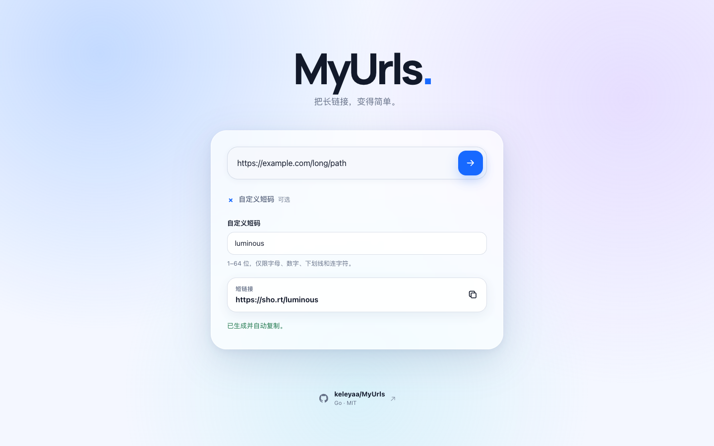
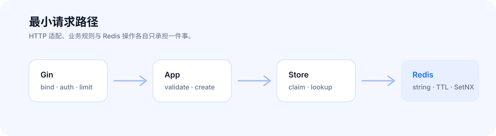

# MyUrls

<p align="center">
  
</p>

<p align="center">
  <strong>一个由 Go、Gin 与 Redis 驱动的轻量短链接服务。</strong><br>
  网页创建、兼容 API、可预测的 301 跳转，以及面向自部署的安全与运维边界。
</p>

<p align="center">
  <a href="#快速开始">快速开始</a> ·
  <a href="#创建与访问短链接">API 示例</a> ·
  <a href="#兼容性与安全边界">安全边界</a> ·
  <a href="docs/operations.md">运维指南</a>
</p>

## 界面预览



输入一个绝对 HTTP(S) 目标网址，MyUrls 会创建一个大小写敏感的短码。访问短码时服务返回
HTTP `301`；健康检查 `GET /healthz` 会实际 Ping Redis。

- **简单集成**：网页界面、`POST /short` 和 `GET /:shortKey`。
- **保留兼容**：表单、multipart、JSON 都可创建；字段保持 `longUrl`、`shortKey`。
- **可靠映射**：裸 Redis key、string value、365 天 TTL 与原子 `SetNX` Claim。
- **可控暴露**：可选 Bearer Token、创建限流、请求体限制与跳转 URL 校验。

## 快速开始

### Docker Compose（推荐）

```sh
cp .env.example .env
# 部署前编辑 .env：至少设置公开域名；公网服务还应设置强 Redis 密码和 API Token。
(
  set +e
  (
    set -eu
    docker compose up -d --wait --wait-timeout 120
    docker compose ps
    curl --fail http://localhost:8080/healthz
  )
  block_status=$?
  if [ "$block_status" -ne 0 ]; then
    docker compose ps --all
    docker compose logs --tail=200 myurls myurls-redis
    false
  fi
)
```

打开 `http://localhost:8080/`。默认 Redis 数据保存在 `./data/redis`；停止服务：

```sh
docker compose down
```

### 本地 Redis

已有 Redis 时，可不使用 Compose：

```sh
redis-cli -h localhost -p 6379 ping
go run . -conn localhost:6379 -proto http -domain localhost:8080 -port 8080
```

第一条命令应返回 `PONG`。Redis 开启密码时同时传入 `-password`；生产环境更推荐用
`MYURLS_REDIS_PASSWORD`，避免密码进入 shell 历史或进程参数。

## 创建与访问短链接

表单与 JSON 都受支持。下面的请求创建短链接，并验证已创建的短码会返回 `301`：

```sh
(
  set -eu
  command -v openssl >/dev/null
  SHORT_KEY="docs-$(openssl rand -hex 8)"
  printf '%s\n' "$SHORT_KEY" | grep -Eq '^docs-[0-9a-f]{16}$'

  # application/x-www-form-urlencoded
  curl --fail-with-body http://localhost:8080/short \
    --data-urlencode 'longUrl=https://example.com/docs' \
    --data-urlencode "shortKey=${SHORT_KEY}"

  # application/json；省略 shortKey 时自动生成 7 位 base62 短码。
  curl --fail-with-body http://localhost:8080/short \
    -H 'Content-Type: application/json' \
    -d '{"longUrl":"https://example.com/guide"}'

  test "$(curl --silent --show-error --output /dev/null --write-out '%{http_code}' \
    "http://localhost:8080/${SHORT_KEY}")" = 301
)
```

成功响应保持兼容：

```json
{"Code":1,"ShortUrl":"https://example.com/aZ4xPq7"}
```

> 业务错误也可能返回 HTTP `200`，调用方必须同时检查响应 JSON 的 `Code`。

### 可选鉴权与限流

`MYURLS_API_TOKEN` 非空时，只有 `POST /short` 需要 Bearer Token；首页、跳转和健康检查
仍可访问。将 `MYURLS_RATE_LIMIT_RPS=0` 可关闭创建限流：

```sh
export MYURLS_API_TOKEN='replace-with-a-strong-random-secret'
export MYURLS_RATE_LIMIT_RPS=2
export MYURLS_RATE_LIMIT_BURST=4
curl --fail-with-body http://localhost:8080/short \
  -H "Authorization: Bearer ${MYURLS_API_TOKEN}" \
  -H 'Content-Type: application/json' \
  -d '{"longUrl":"https://example.com/private"}'
```

## 它如何工作

<p align="center">
  
</p>

HTTP 层负责绑定请求、安全 middleware 与遗留响应；`App` 只负责验证、创建和解析；`Store`
负责 Redis 的 `Claim` / `Lookup`。这让一次创建请求只经过必要概念，同时保留既有接口和数据格式。

## 兼容性与安全边界

| 主题 | 保持的行为 | 边界 |
| --- | --- | --- |
| 创建接口 | `POST /short`；form、multipart、JSON；`longUrl` / `shortKey` | 业务成功仍是 HTTP `200` + `Code:1` |
| 跳转 | `GET /:shortKey` 返回 HTTP `301` | 缺失为 `404`；Redis 故障为 `500` |
| 短码 | 7 位 base62、大小写敏感、最多 5 次碰撞重试 | 保留路由保留词 |
| 数据 | 裸 key、string value、365 天 TTL、原子 `SetNX` | 不加 namespace，不迁移 schema |
| 输入 | 仅绝对 HTTP(S) URL；拒绝 userinfo | 保留 Base64 fallback，并在解码后校验 |
| 容器 | 非 root、只读根文件系统、移除 Linux capabilities | Compose 不发布 Redis 宿主机端口 |
| 日志 | 应用与访问日志统一 stdout | 不记录 URL、短码、Token、凭据、请求体或 Authorization |

Redis 默认只在 Compose 网络内可达；Docker 管理员或获准加入该网络的容器仍可能访问 Redis。
详情、备份恢复与 Redis major 升级边界见[运维指南](docs/operations.md)。

## 配置

环境变量优先于同名 command-line flag。完整默认值、超时与故障处理请参阅
[运维指南的配置表](docs/operations.md#配置表)。

| 变量 | 默认值 | 说明 |
| --- | --- | --- |
| `MYURLS_PORT` | `8080` | HTTP 监听端口与 Compose 宿主机映射 |
| `MYURLS_DOMAIN` | `example.com` | 返回短链接的域名，可含端口 |
| `MYURLS_PROTO` | `https` | 返回短链接的协议 |
| `MYURLS_BASE_URL` | 空 | 完整公开基址；非空时优先于 Domain/Proto，可包含 path prefix |
| `MYURLS_REDIS_CONN` | `myurls-redis:6379` | Redis 地址；Compose 内使用服务名 |
| `MYURLS_REDIS_URL` | 空 | `redis://` / `rediss://` URI；非空时优先于旧地址与密码变量 |
| `MYURLS_REDIS_PASSWORD` | 空 | Redis 密码；部署时应使用强随机秘密 |
| `MYURLS_API_TOKEN` | 空 | `POST /short` 的可选 Bearer Token；空值关闭鉴权 |
| `MYURLS_RATE_LIMIT_RPS` | `5` | 每秒补充令牌数；`0` 关闭限流 |
| `MYURLS_RATE_LIMIT_BURST` | `10` | 创建限流突发容量 |
| `MYURLS_MAX_BODY_BYTES` | `16384` | 创建请求体最大字节数，最小为 1024 |

`MYURLS_REDIS_URL` 支持 URI 中的用户名、密码和数据库编号（0–15）；`rediss://` 启用 TLS。
解析失败时程序只返回固定错误，不在错误或日志中回显 URI 凭据。

`MYURLS_BASE_URL` 只接受无凭据、无 query、无 fragment 的绝对 HTTP(S) URL。例如
`https://example.com/links` 会生成 `https://example.com/links/<shortKey>`。

### 二进制参数

| Flag | 默认值 | 说明 |
| --- | --- | --- |
| `-h` | `false` | 显示帮助并退出 |
| `-port` | `8080` | HTTP 监听端口 |
| `-domain` | `localhost:8080` | 生成短链接时使用的域名，可含端口 |
| `-proto` | `https` | 生成短链接时使用的协议 |
| `-conn` | `localhost:6379` | Redis 地址 |
| `-password` | 空 | Redis 密码 |
| `-healthcheck` | `false` | 请求本机 `/healthz`，按结果退出，不启动服务 |

```sh
./myurls -healthcheck -port 8080
```

## 镜像、运维与测试

- **镜像发布**：GHCR 只在扁平的 `v*` Git 标签或手动运行时构建
  `ghcr.io/keleyaa/myurls`。稳定 `vX.Y.Z` 才会更新 `latest`；使用前请在 Packages 页面确认标签。
  镜像部署与 digest 回滚请参阅[镜像升级](docs/operations.md#镜像升级)。
- **日志与恢复**：日志使用 `Asia/Shanghai`（UTC+8）并经 Compose `json-file` 轮转（10 MB × 3）。
  Redis 不支持跨 major 原地升级或降级，必须先完成隔离恢复演练；详见[运维指南](docs/operations.md)。
- **运行要求**：Go `1.25.0`（建议使用固定的 `go1.26.5` toolchain）、Redis 7.4 或 8.x、
  Docker Engine + Compose v2。浏览器 E2E 还需要 Node.js 24.18.1 和 Chromium。

```sh
# 构建当前平台二进制到 build/myurls
make

# Go 格式、vet 和单元测试
make verify

# 真实 Redis 集成测试；需先启动 Redis
MYURLS_REDIS_CONN=localhost:6379 go test -tags=integration -count=1 ./tests/integration

# 浏览器端到端测试；需先启动 Compose 服务
npm ci
npx playwright install chromium
npm run test:e2e
```

GitHub Actions 执行格式、vet、单元/乱序/race/漏洞、真实 Redis、跨平台构建、容器边界与
桌面/移动 E2E 门禁。只有远端 workflow 实际完成后，才可认定 CI 通过。

## 维护者与许可

原作者与维护者：[@CareyWang](https://github.com/CareyWang)。欢迎提交 PR。

MIT © 2024 CareyWang。完整文本见 [LICENSE](LICENSE)。
